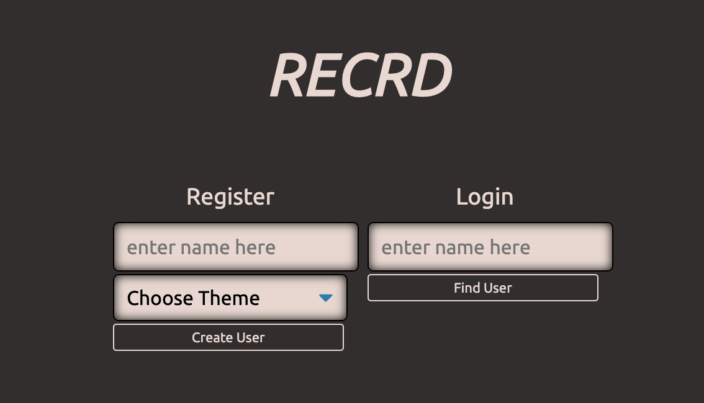
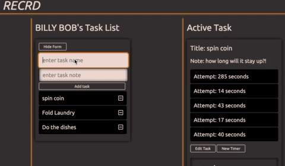
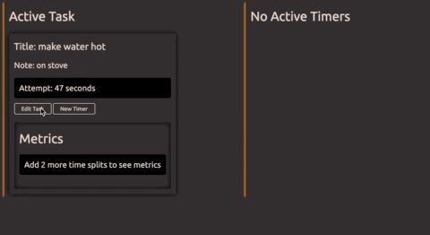
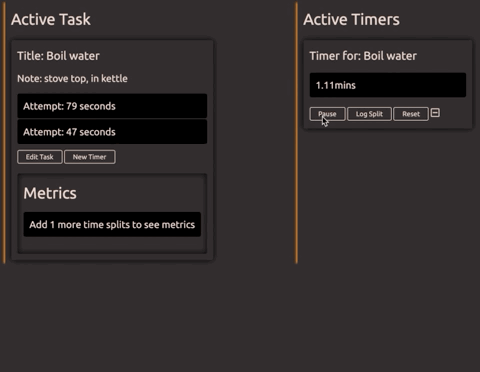
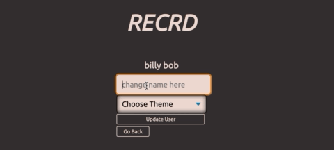

# RECRD

## To-Do list app with timer

   * [RECRD website](https://recrd-react-front-end.firebaseapp.com/)

   * [Backend GitHub](https://github.com/codeHustler91/Recrd-backend)

Thanks for visiting!

Project by [@codeHustler91](https://github.com/codeHustler91)

## Basic flow of app

### Welcome Menu
   * Login to existing account
   * Register for new account

   

### Main User Page
   * Task List
       * Save your daily tasks
       * Write a note for each task
       * Click a task to start recording times!
       
   
   * Active Task
       * Show task
       * Edit task information
       * Click "New Timer" to get a stopwatch for that task
       
   
   * Metrics
       * After 3 data points have been captured:
       * Shows Shortest, Longest, Average, and Total times for the Task
       
   
   * Log out of your account

### Settings
   * Change your name
   * Change your theme (coming soon)

   

### Model

   User ---------< Tasks ----------< Attempts

   User has many tasks, tasks have many attempts

### Assets used:
   * React.js
   * Redux
